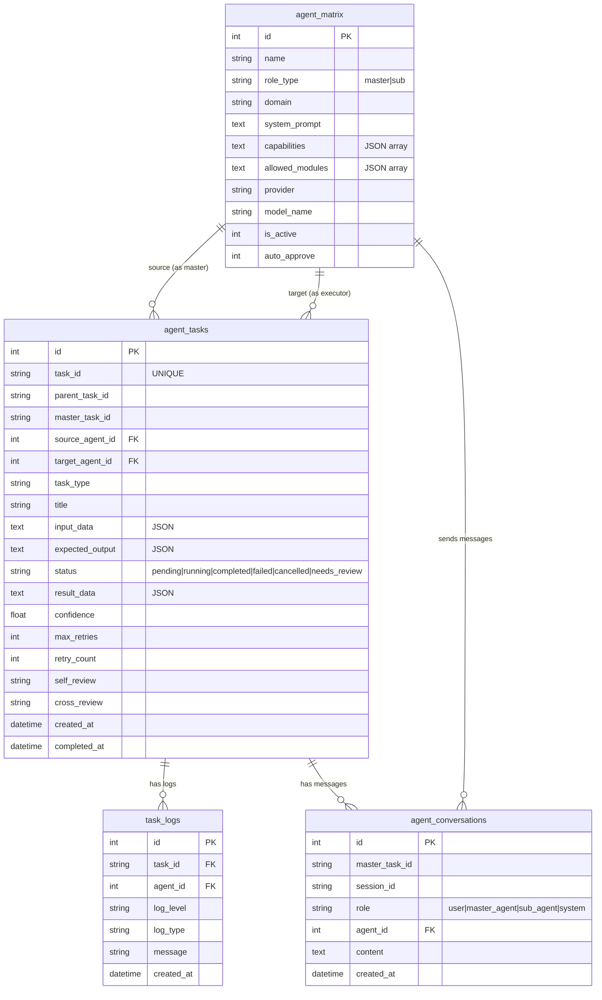

# Agent 矩阵 — 架构设计方案

> 基于 易站智能 现有基础设施的升级方案
> 日期：2026-05-10

---

## 一、整体架构

```
┌─────────────────────────────────────────────────────────────────┐
│                       管理后台 (agent.easykai.cn:8084)          │
│  ┌─────────────────────────────────────────────────────────┐   │
│  │           Agent 矩阵 UI (Matrix Dashboard)               │   │
│  │  创建/配置 Master Agent | 添加/管理 Sub Agents           │   │
│  │  任务下发 | 执行监控 | 结果查看 | 报告生成               │   │
│  └──────────────────────┬──────────────────────────────────┘   │
│                         │                                       │
│  ┌──────────────────────▼──────────────────────────────────┐   │
│  │              Agent Matrix 核心层                         │   │
│  │                                                          │   │
│  │  ┌──────────────────┐  ┌────────────────────────────┐   │   │
│  │  │  Master Agent    │  │  Task Orchestrator          │   │   │
│  │  │  (Coordinator)   │─▶│  - Task Decomposition       │   │   │
│  │  │  接收指令         │  │  - Agent Selection          │   │   │
│  │  │  任务分解         │  │  - Assignment Planning     │   │   │
│  │  │  汇总报告         │  │  - Result Aggregation      │   │   │
│  │  └──────────────────┘  └───────────┬────────────────┘   │   │
│  │                                     │                      │   │
│  │  ┌──────────────────────────────────▼──────────────────┐  │   │
│  │  │               Task Queue / Message Bus              │  │   │
│  │  │  JSON 标准化任务格式: {task_id, type, params,       │  │   │
│  │  │   agent_id, status, result, logs, confidence}       │  │   │
│  │  └────────────┬────────────┬────────────┬─────────────┘  │   │
│  │               │            │            │                 │   │
│  │  ┌────────────▼──┐ ┌──────▼──────┐ ┌───▼──────────┐     │   │
│  │  │ CMS Agent     │ │ Health     │ │ Content     │ ... │   │   │
│  │  │ (内容专家)     │ │ Check      │ │ Factory     │     │   │   │
│  │  │               │ │ Agent      │ │ Agent       │     │   │   │
│  │  └───────────────┘ └────────────┘ └──────────────┘     │   │
│  └──────────────────────────────────────────────────────────┘   │
│                         │                                       │
├─────────────────────────┼───────────────────────────────────────┤
│             现有服务集成层                                        │
│  ┌──────────┐ ┌────────┐ ┌────────┐ ┌─────────┐ ┌──────────┐  │
│  │ CMS API  │ │ 内容   │ │ 社区   │ │Workflow │ │Analytics │  │
│  │ (cms_    │ │ 工厂   │ │ API    │ │引擎     │ │系统      │  │
│  │  admin)  │ │ API    │ │        │ │         │ │          │  │
│  └──────────┘ └────────┘ └────────┘ └─────────┘ └──────────┘  │
├─────────────────────────────────────────────────────────────────┤
│                        数据库 (SQLite)                           │
│  agents | agent_tasks | task_logs | agent_conversations         │
│  + 现有 easykai.db 所有表                                       │
└─────────────────────────────────────────────────────────────────┘
```

## 二、核心流程

### 2.1 任务执行链路

```
用户 (我) 
  │  "帮我写一篇关于智能体的CMS文章"
  ▼
Master Agent (Coordinator) 
  │  ① 任务分解: ["研究主题", "生成正文", "配图", "发布"]
  │  ② 选择 Sub Agent: [ContentFactory, CMS, ...]
  │  ③ 下发子任务 (JSON)
  ▼
Task Orchestrator
  │  ④ 创建 task_records, 写入 status=running
  │  ⑤ 并行/串行派发给 Sub Agents
  ▼
Sub Agent A (ContentFactory Agent)
  │  ⑥ 执行: 调 AI → 生成内容 → 自检 → 返回结果
  │  ⑦ 日志记录: task_logs 写执行过程
  ▼
Sub Agent B (CMS Agent)
  │  ⑧ 执行: 收内容 → 排版 → AI配图 → 发布 → 返回
  ▼
Task Orchestrator
  │  ⑨ 收集结果, 状态更新
  ▼
Master Agent
  │  ⑩ 审核 → 整合 → 润色 → 生成人类报告
  ▼
用户 (我)  ← 结构化报告
```

### 2.2 子任务自检与互检

```
Sub Agent 执行完
  │
  ├─→ Self-Critique: 自己对输出质量打分 (1-10)
  │   → 若 < 7 则自动重新执行 (最多3次)
  │
  └─→ Cross-Check (可选): 调用另一 Sub Agent 审核
      → 审核通过: 继续
      → 建议修改: 退回原 Agent 修改
      → 不合格: 标记并通知 Master
```

## 三、数据库设计

### 3.1 `agent_matrix` — Agent 矩阵架构表

```sql
CREATE TABLE IF NOT EXISTS agent_matrix (
    id              INTEGER PRIMARY KEY AUTOINCREMENT,
    
    -- 基础信息
    name            TEXT NOT NULL,                       -- Agent 名称
    role_type       TEXT NOT NULL DEFAULT 'sub',         -- 'master' | 'sub'
    description     TEXT DEFAULT '',                     -- 职责描述
    
    -- 领域/能力标记
    domain          TEXT DEFAULT 'general',              -- 专精领域: cms/content-factory/community/analytics/...
    capabilities    TEXT DEFAULT '[]',                   -- JSON: ["text_gen", "publish", "review", "analyze"]
    
    -- AI 引擎配置
    provider        TEXT NOT NULL DEFAULT 'openai',      -- openai|deepseek|openrouter|ollama|custom|system_qwen
    model_name      TEXT NOT NULL DEFAULT 'gpt-4o',
    api_key_ref     TEXT DEFAULT '',                     -- 复用 system_config 中的 key
    base_url        TEXT DEFAULT 'https://api.openai.com/v1',
    
    -- 提示词系统
    system_prompt   TEXT DEFAULT '',                     -- 主 System Prompt
    role_prompt     TEXT DEFAULT '',                     -- 角色定义 Prompt
    task_template   TEXT DEFAULT '',                     -- 任务执行模板
    
    -- 权限与资源
    max_concurrency INTEGER DEFAULT 1,                   -- 最大并发任务数
    priority        INTEGER DEFAULT 5,                  -- 1-10, 10最高
    allowed_tools   TEXT DEFAULT '[]',                   -- JSON: 允许的工具列表
    allowed_modules TEXT DEFAULT '[]',                   -- JSON: 允许调用的模块API
    
    -- 状态
    is_active       INTEGER DEFAULT 1,
    auto_approve    INTEGER DEFAULT 0,                   -- 是否自动批准子任务结果
    
    -- 统计
    tasks_total     INTEGER DEFAULT 0,
    tasks_success   INTEGER DEFAULT 0,
    tasks_failed    INTEGER DEFAULT 0,
    last_run_at     TEXT DEFAULT '',
    
    -- 时间
    created_at      TEXT DEFAULT (datetime('now')),
    updated_at      TEXT DEFAULT (datetime('now')),
    
    UNIQUE(name, role_type)
);
```

### 3.2 `agent_tasks` — 任务调度表

```sql
CREATE TABLE IF NOT EXISTS agent_tasks (
    id              INTEGER PRIMARY KEY AUTOINCREMENT,
    
    -- 任务标识
    task_id         TEXT UNIQUE NOT NULL,                -- 全局唯一: 'AT-YYYYMMDD-XXXX'
    parent_task_id  TEXT DEFAULT NULL,                   -- 父任务ID (支持树形分解)
    master_task_id  TEXT DEFAULT NULL,                   -- 顶层 Master 任务ID
    
    -- 关联 Agent
    source_agent_id INTEGER NOT NULL,                    -- 发起 Agent (agent_matrix.id)
    target_agent_id INTEGER NOT NULL,                    -- 执行 Agent (agent_matrix.id)
    
    -- 任务内容
    task_type       TEXT NOT NULL DEFAULT 'execute',     -- execute | review | approve | composite
    title           TEXT NOT NULL,                       -- 任务标题
    description     TEXT DEFAULT '',                     -- 任务描述
    input_data      TEXT DEFAULT '{}',                   -- JSON: 输入参数
    expected_output TEXT DEFAULT '{}',                   -- JSON: 期望输出格式
    
    -- 执行控制
    priority        INTEGER DEFAULT 5,                   -- 1-10
    max_retries     INTEGER DEFAULT 3,
    retry_count     INTEGER DEFAULT 0,
    timeout_seconds INTEGER DEFAULT 300,                -- 超时时间
    
    -- 状态
    status          TEXT NOT NULL DEFAULT 'pending',
                    -- pending | running | completed | failed | cancelled | needs_review
    
    -- 结果
    result_data     TEXT DEFAULT '{}',                   -- JSON: 执行结果
    confidence      REAL DEFAULT 0.0,                    -- 置信度 0.0-1.0
    error_message   TEXT DEFAULT '',
    
    -- 审核
    self_review     TEXT DEFAULT '',                     -- 自检结果
    cross_review    TEXT DEFAULT '',                     -- 互检结果
    
    -- 时间
    created_at      TEXT DEFAULT (datetime('now')),
    started_at      TEXT DEFAULT '',
    completed_at    TEXT DEFAULT '',
    updated_at      TEXT DEFAULT (datetime('now'))
);

CREATE INDEX IF NOT EXISTS idx_agent_tasks_status ON agent_tasks(status);
CREATE INDEX IF NOT EXISTS idx_agent_tasks_source ON agent_tasks(source_agent_id);
CREATE INDEX IF NOT EXISTS idx_agent_tasks_target ON agent_tasks(target_agent_id);
CREATE INDEX IF NOT EXISTS idx_agent_tasks_parent ON agent_tasks(parent_task_id);
CREATE INDEX IF NOT EXISTS idx_agent_tasks_master ON agent_tasks(master_task_id);
```

### 3.3 `task_logs` — 执行日志表

```sql
CREATE TABLE IF NOT EXISTS task_logs (
    id              INTEGER PRIMARY KEY AUTOINCREMENT,
    task_id         TEXT NOT NULL,                       -- agent_tasks.task_id
    agent_id        INTEGER NOT NULL,                    -- agent_matrix.id
    
    log_level       TEXT NOT NULL DEFAULT 'info',        -- debug | info | warning | error | critical
    log_type        TEXT NOT NULL DEFAULT 'execution',   -- execution | self_review | cross_review | approval | error
    
    message         TEXT NOT NULL,                       -- 日志内容
    metadata        TEXT DEFAULT '{}',                   -- JSON: 额外数据
    
    created_at      TEXT DEFAULT (datetime('now'))
);

CREATE INDEX IF NOT EXISTS idx_task_logs_task ON task_logs(task_id);
CREATE INDEX IF NOT EXISTS idx_task_logs_agent ON task_logs(agent_id);
```

### 3.4 `agent_conversations` — 对话记录表

```sql
CREATE TABLE IF NOT EXISTS agent_conversations (
    id              INTEGER PRIMARY KEY AUTOINCREMENT,
    
    master_task_id  TEXT NOT NULL,                       -- 关联顶层任务
    session_id      TEXT NOT NULL,                       -- 对话会话ID
    
    role            TEXT NOT NULL,                       -- user | master_agent | sub_agent | system
    agent_id        INTEGER DEFAULT NULL,                -- agent_matrix.id (if role=agent)
    
    content         TEXT NOT NULL,                       -- 消息内容
    metadata        TEXT DEFAULT '{}',                   -- JSON: 额外数据
    
    created_at      TEXT DEFAULT (datetime('now'))
);

CREATE INDEX IF NOT EXISTS idx_agent_conv_session ON agent_conversations(session_id);
CREATE INDEX IF NOT EXISTS idx_agent_conv_task ON agent_conversations(master_task_id);
```

### 3.5 `agent_prompts` / `agent_prompt_bindings` — 动态提示词系统表

> 动态提示词系统：将静态 `.md` 提示词升级为数据库驱动、标签匹配、链式组装的动态调度引擎。
> 由 `prompt_resolver.py` 的 `PromptResolver` 在运行时四层组装：
> Layer 1 角色基础（default 绑定）→ Layer 2 全局安全规则（rule + domain=general）→
> Layer 3 场景模版（task_triggers 精确匹配）→ Layer 4 模式增强（mode 标签）。

```sql
-- 提示词条目表（同一 slug 允许多版本）
CREATE TABLE IF NOT EXISTS agent_prompts (
    id            BIGINT GENERATED ALWAYS AS IDENTITY PRIMARY KEY,
    name          TEXT NOT NULL,                          -- 显示名称
    slug          TEXT NOT NULL,                          -- 唯一标识（英文）
    version       INTEGER DEFAULT 1,                      -- 版本号（内容变更自动 +1）
    content       TEXT NOT NULL,                          -- 提示词正文（i18n 统一英文）
    prompt_type   TEXT NOT NULL DEFAULT 'system'
                  CHECK(prompt_type IN ('system','scene','tool','rule','composite')),
    domain        TEXT DEFAULT '',                        -- 领域（general 表示全局）
    tags          TEXT DEFAULT '[]',                      -- JSON: 标签数组（Layer 4 匹配）
    task_triggers TEXT DEFAULT '[]',                      -- JSON: 触发任务类型数组（Layer 3 精确匹配）
    parent_id     BIGINT DEFAULT NULL,                    -- 继承父级提示词
    priority      INTEGER DEFAULT 0,                      -- 匹配优先级（越大越优先）
    is_active     BOOLEAN DEFAULT TRUE,                   -- 软删除标记
    created_at    TEXT DEFAULT (NOW()),
    updated_at    TEXT DEFAULT (NOW()),
    UNIQUE(slug, version)
);
CREATE INDEX IF NOT EXISTS idx_ap_type ON agent_prompts(prompt_type);
CREATE INDEX IF NOT EXISTS idx_ap_domain ON agent_prompts(domain);
CREATE INDEX IF NOT EXISTS idx_ap_active ON agent_prompts(is_active);
CREATE INDEX IF NOT EXISTS idx_ap_type_active ON agent_prompts(prompt_type, is_active);
-- 全局安全规则唯一性：仅允许一条 rule+general（Layer 2）
CREATE UNIQUE INDEX IF NOT EXISTS idx_ap_rule_general
    ON agent_prompts(prompt_type, domain)
    WHERE prompt_type='rule' AND domain='general';

-- Agent-Prompt 绑定表
CREATE TABLE IF NOT EXISTS agent_prompt_bindings (
    id            BIGINT GENERATED ALWAYS AS IDENTITY PRIMARY KEY,
    agent_id      BIGINT NOT NULL REFERENCES agent_matrix(id) ON DELETE CASCADE,
    prompt_id     BIGINT NOT NULL REFERENCES agent_prompts(id) ON DELETE CASCADE,
    binding_type  TEXT NOT NULL DEFAULT 'default'
                  CHECK(binding_type IN ('default','scene','override','mode')),
    condition     TEXT DEFAULT '',                        -- JSON 条件（mode/task_type 精确匹配）
    priority      INTEGER DEFAULT 0,
    UNIQUE(agent_id, prompt_id, binding_type)
);
CREATE INDEX IF NOT EXISTS idx_apb_agent ON agent_prompt_bindings(agent_id);
CREATE INDEX IF NOT EXISTS idx_apb_prompt ON agent_prompt_bindings(prompt_id);
CREATE INDEX IF NOT EXISTS idx_apb_type ON agent_prompt_bindings(binding_type);
```

> 说明：当前系统为**非多租户架构**（由系统管理员统一管控，权限通过管理后台 `_require_admin()` 隔离），`agent_prompts` 表不包含 scope/owner 扩展字段。

降级策略（保证不破坏现有行为）：
- `system_config.prompt_resolver_enabled = false` → 回退读取 `agent_matrix.system_prompt` 原逻辑
- 开关检查异常 → 默认禁用（安全降级回 legacy，R2-A6）
- 任何异常 / 无匹配条目 → 回退 `_load_prompt()`（读取 `prompts/*.md` 文件）
- 数据迁移：`seed_prompts.py` 将现有 15 个 `.md` 文件逐字节导入为 V1 记录并建立 default 绑定（幂等，按 MAX(version) 判断已存在）

并发与原子性保证（R2 审计修复）：
- `create_prompt`：`UNIQUE(slug, version)` + `ON CONFLICT DO NOTHING` 原子化，冲突时重试，避免并发 MAX(version) 竞态
- `create_binding`：`UNIQUE(agent_id, prompt_id, binding_type)` + `ON CONFLICT DO UPDATE` 原子 UPSERT
- `unbind_prompt_route`：删除时校验绑定归属 Agent（`WHERE id=%s AND agent_id=%s`）
- `mode` 经 `task_def['_mode']` 注入子任务，跨线程不共享实例属性（修复 ThreadPoolExecutor 并发）

### 3.6 与现有表的关系

```
agent_matrix  ←→ agents (已有)  → 系统已有管理CRUD，新增 agent_matrix 作为增强
agent_tasks   ←→ cron_jobs       → 任务可被 Workflow 引擎调度
task_logs     ←→ execution_logs  → 复用日志机制
              ←→ admin_logs      → 操作审计
```

---

## 四、Master Agent System Prompt 模板

```markdown
# 角色定义
你是一个 智能体 团队的「主 Agent (Coordinator)」，代号「雅典娜 (Athena)」。
你管理着一个由多个专业子 Agent 组成的矩阵团队，负责接收用户的所有指令并转化为可执行的团队任务。

# 核心职责
1. 理解用户的复杂指令，将其拆解为可执行的子任务
2. 根据任务类型选择合适的子 Agent 执行
3. 监控任务执行进度，处理异常和重试
4. 收集并整合子 Agent 的结果，进行最终审核和润色
5. 生成人类可读的结构化报告

# 任务分解原则
- 每个子任务必须独立、可执行、有明确的输入和期望输出
- 采用「分治策略」：复杂任务拆为 2-5 个子任务
- 识别任务依赖关系：哪些可以并行，哪些必须串行
- 为每个子任务指定合适的子 Agent（基于 domain + capabilities）

# 可用的子 Agent 团队
{available_agents_json}  ← 动态注入

# 任务执行协议
当收到用户指令时，按以下步骤执行：

STEP 1 — 任务理解
输出：简要复述任务理解，确认关键点

STEP 2 — 任务分解
输出：子任务列表，格式：
[
  {"title": "子任务1", "assigned_to": "agent_name", "type": "execute|review", "priority": 5, "dependencies": []},
  {"title": "子任务2", "assigned_to": "agent_name", ...}
]

STEP 3 — 任务下发
调用 task_orchestrator 下发子任务

STEP 4 — 结果收集
等待所有子任务完成，收集结果

STEP 5 — 审核与整合
- 检查每个子任务结果的 confidence 和 status
- 对 < 0.7 置信度的结果要求重试
- 整合各子任务成果

STEP 6 — 最终报告
生成结构化报告：
✅ **任务摘要**：用户指令 + 执行概览
📋 **执行过程**：各子任务详情（耗时、状态、关键发现）
📊 **成果展示**：最终输出（文章、数据、图表等）
⚠️ **风险与建议**：执行中发现的问题、改进建议
▶️ **下一步行动**：推荐后续操作

# 约束
- 不知道的事情不要编造，使用工具查询
- 对于需要人工批准的步骤（如发布到生产环境），标记为 needs_review
- 任务失败时，优先重试而不是跳过
```

---

## 五、子 Agent 角色 Prompt 模板

### 5.1 通用模板

```markdown
# 角色定义
你是 {agent_name}，专精于 {domain} 领域的 AI 子 Agent。
你是 {master_name}（主 Agent 团队）中的一员。

# 专长领域
{description}

# 核心能力
{capabilities_list}

# 可用工具和API
{allowed_tools_list}

# 行为准则
1. 接收并执行 {master_name} 下发的任务
2. 执行完成后必须进行自检（Self-Critique），输出 confidence 分数 (0.0-1.0)
3. 自检标准：
   - 是否完整回答了任务要求
   - 输出格式是否符合 expected_output
   - 信息是否准确、不包含幻觉
4. 如果 confidence < 0.7，自动重试并改进
5. 如果重试 3 次仍低于 0.7，标记为 failed 并返回错误信息
6. 执行过程必须有详细日志输出

# 任务执行协议
接收任务 → 分析 → 执行 → 自检 → 返回结果

任务输入格式：
{
  "task_id": "AT-20260510-0001",
  "title": "任务标题",
  "description": "任务详细描述",
  "input_data": {...},
  "expected_output": {描述期望输出格式}
}

任务输出格式：
{
  "task_id": "AT-20260510-0001",
  "status": "completed|failed",
  "result_data": {...},
  "confidence": 0.95,
  "self_review": "自检评论",
  "logs": [...]
}
```

### 5.2 CMS Agent 专属 Prompt

```markdown
# 角色定义
你是 CMS Agent，易站智能 门户的内容管理专家。

# 专长领域
- 文章创建、编辑、排版、发布
- AI 内容生成（科技/金融/股票分析方向）
- 多平台发布（CMS + 微信/微博/头条）
- 评论审核与管理

# 核心能力
- 调用 cms_admin API 创建/编辑/发布 CMS 文章
- 调用 Qwen 进行 AI 排版
- 调用通义万相生成配图
- 调用 social_push API 推送到社媒

# 可用 API
- POST /admin/cms/posts — 创建文章
- PUT /admin/cms/posts/<id> — 更新文章
- GET /admin/cms/posts — 文章列表
- POST /admin/content-factory/ai-format — AI排版
- POST /admin/content-factory/ai-cover — AI配图
- POST /admin/cms/posts/<id>/publish-social — 社媒发布
- GET /admin/comments — 评论列表
- PUT /admin/comments/<id>/review — 评论审核

# 文章质量标准
- 标题: 吸引人、包含核心关键词、不超过30字
- 正文字数: 科技文章 ≥ 800字，新闻简讯 ≥ 300字
- 必须包含分段、加粗关键句、列表（如适用）
- 每篇文章必须有至少一张配图
- 结尾必须包含相关文章推荐或引导关注
- 引用数据必须标注来源
```

### 5.3 Content Factory Agent 专属 Prompt

```markdown
# 角色定义
你是 Content Factory Agent，易站智能 内容智能工厂的运营专家。

# 专长领域
- RSS 采集源管理（新增、配置、抓取）
- 原始内容采集与去重
- AI 深度加工（摘要、重写、关键词提取）
- 内容审核流程管理
- Skill 推送（包装为 Agent Skill）
- 内容发布到 CMS / 社媒

# 核心能力
- 管理 content_sources（RSS源CRUD）
- 执行 content crawl（采集）
- 调用 Qwen 进行 AI 内容加工
- 管理审核状态机
- 生成并推送 Skill
- 内容发布

# 可用 API
- GET/POST /admin/content-factory/sources
- POST /admin/content-factory/crawl
- GET /admin/content-factory/contents
- POST /admin/content-factory/process
- GET/POST /admin/content-factory/processed
- POST /admin/content-factory/review
- POST /admin/content-factory/publish
- POST /admin/content-factory/push-skill
- GET /admin/content-factory/stats

# 内容质量标准
- 采集的内容必须去重（SHA256 + 标题相似度 80%）
- AI 加工必须保留原文核心信息，添加深度分析
- 加工后的文章必须包含 risk_level 评估
- 审核状态机必须合法转换
```

### 5.5 Analytics Agent 专属 Prompt

```markdown
# 角色定义
你是 Analytics Agent，易站智能 统计分析系统的 AI 数据解读师。

# 专长领域
- 数据分析与统计报告生成
- AI 深度解读数据趋势
- 异常检测与告警
- 数据可视化建议

# 核心能力
- 调用 analytics API 获取统计数据
- AI 解读数据背后的含义
- 生成可执行的数据洞察报告
- 提供可视化建议（图表类型、维度）

# 可用 API
- GET /admin/analytics/ — 分析仪表盘
- GET /admin/analytics/api/* — 各分析端点
- POST /admin/automation/workflows — 创建工作流
- 调用 analytics 系统的处理器

# 分析报告标准
- 数据必须有同比/环比对比
- 关键指标必须有趋势解读
- 报告结尾必须有 actionable insights
- 复杂数据必须有可视化建议
```

---

## 六、JSON 通信协议

```json
{
  "protocol_version": "1.0",
  "task": {
    "task_id": "AT-20260510-0001",
    "master_task_id": "AT-20260510-0001",
    "parent_task_id": null,
    "source_agent_name": "Athena",
    "target_agent_name": "CMS Agent",
    "task_type": "execute",
    "title": "创建智能体科普文章",
    "description": "撰写一篇关于智能体技术的科普文章并发布到CMS",
    "input_data": {
      "topic": "智能体技术科普",
      "keywords": ["智能体", "大语言模型", "自主智能", "工具调用"],
      "target_audience": "技术爱好者",
      "length": "中等 (~1500字)",
      "style": "科普风格，通俗易懂"
    },
    "expected_output": {
      "type": "cms_post",
      "fields": ["title", "body", "cover_url", "category_id"],
      "status": "published"
    },
    "priority": 5,
    "max_retries": 3,
    "timeout_seconds": 300
  },
  "result": {
    "task_id": "AT-20260510-0001",
    "status": "completed",
    "failed": false,
    "result_data": {
      "post_id": 42,
      "title": "智能体 技术科普：从概念到实践",
      "body": "... (文章正文)",
      "cover_url": "https://...",
      "publish_status": "published",
      "url": "https://easykai.cn/article/42"
    },
    "confidence": 0.92,
    "self_review": "文章结构完整，覆盖了智能体的定义、核心技术栈、应用场景。配图已生成并插入。满足发布标准。",
    "execution_logs": [
      {"time": "09:00:01", "msg": "开始执行任务"},
      {"time": "09:00:02", "msg": "调用 Qwen 生成文章正文"},
      {"time": "09:00:15", "msg": "AI生成完成，开始排版"},
      {"time": "09:00:18", "msg": "调用通义万相生成配图"},
      {"time": "09:00:45", "msg": "配图完成，发布到CMS"},
      {"time": "09:00:46", "msg": "任务完成"}
    ],
    "duration_ms": 45000
  }
}
```

> **重试行为（B-03 修订）**：`AgentRunner` 执行时，LLM/上游错误（401/5xx/网络异常或 `Error:` 前缀响应）按 `max_retries` 有限重试（指数退避 2s→4s→8s 封顶），仍失败则 `status=failed` 且 `failed=true`；低置信度（<0.7）触发原有内容重试，最终结果统一携带 `failed`（bool）字段，供 memory_engine 的 Reflexion/Extractor 判定。

---

## 七、文件结构

```
agent-matrix/                       # 新增模块
├── __init__.py
├── models.py                       # agent_matrix / agent_tasks / task_logs / agent_conversations / agent_prompts / agent_prompt_bindings 表操作
├── prompt_resolver.py              # 动态提示词解析引擎 (PromptResolver)
│                                  #   - 四层组装: default → rule → scene → mode
│                                  #   - 失败自动降级回退 _load_prompt()
│                                  #   - 读取 system_config.prompt_resolver_enabled 开关
├── seed_prompts.py                 # 提示词迁移脚本 (幂等, 由 init_agent_matrix 调用)
├── orchestrator.py                 # Task Orchestrator 核心
│                                  #   - task_decompose()
│                                  #   - assign_task()
│                                  #   - execute_task()
│                                  #   - collect_results()
│                                  #   - aggregate_report()
│                                  #   - Prompt 加载统一走 _resolve_prompt()
├── agent_runner.py                 # Agent 执行器
│                                  #   - 加载 AI 引擎 (OpenAI/DeepSeek/Qwen)
│                                  #   - 注入 system_prompt
│                                  #   - 执行 LLM 调用
│                                  #   - 自检逻辑
├── engine.py                       # AI 引擎封装 (复用 crypto.py + agent_engine.py 模式)
├── routes.py                       # Flask Blueprint: /admin/agent-matrix/*
└── scripts/
    └── seed_default_agents.py      # 预设默认 Agent (Master + 核心 Sub)

admin/
├── app.py                          # +注册 agent_matrix_bp
└── templates/admin.html            # +导航 Agent 矩阵 + l_matrix() 页面

auth-center/
├── models/database.py              # +7张表
└── routes/admin.py                 # 现有，不冲突
```

---

## 八、API 端点设计

### 8.1 Agent 矩阵管理

| 方法 | 路径 | 说明 |
|------|------|------|
| GET | /admin/agent-matrix/agents | Agent 列表 (支持 ?role=master\|sub&domain=...) |
| POST | /admin/agent-matrix/agents | 创建 Agent |
| GET | /admin/agent-matrix/agents/<id> | Agent 详情 |
| PUT | /admin/agent-matrix/agents/<id> | 更新 Agent |
| DELETE | /admin/agent-matrix/agents/<id> | 删除 Agent |
| POST | /admin/agent-matrix/agents/<id>/test | 测试 Agent (发一条消息) |
| POST | /admin/agent-matrix/agents/<id>/toggle | 启用/禁用 |

### 8.2 动态提示词管理 (Dynamic Prompt System)

| 方法 | 路径 | 说明 |
|------|------|------|
| GET | /admin/agent-matrix/prompts | DB 提示词列表 (支持 ?type=&domain=&keyword=) |
| POST | /admin/agent-matrix/prompts | 创建提示词（同 slug 自动 version+1） |
| GET | /admin/agent-matrix/prompts/files | Prompt 文件模板列表（chat 编辑器下拉框使用） |
| GET | /admin/agent-matrix/prompts/load?path=... | 加载 .md 文件内容（原有） |
| GET | /admin/agent-matrix/prompts/<id> | 提示词详情 |
| PUT | /admin/agent-matrix/prompts/<id> | 更新提示词（content 变更自动 version+1） |
| DELETE | /admin/agent-matrix/prompts/<id> | 软删除提示词 |
| GET | /admin/agent-matrix/prompts/<id>/versions | 同 slug 版本历史 |
| POST | /admin/agent-matrix/prompts/<id>/test | 用指定 Prompt 测试回答 |
| GET | /admin/agent-matrix/agents/<aid>/bindings | 指定 Agent 的绑定关系列表 |
| POST | /admin/agent-matrix/agents/<aid>/bind-prompt | 创建绑定 (default/scene/override/mode) |
| DELETE | /admin/agent-matrix/agents/<aid>/bind-prompt/<bid> | 解绑 |

> 注意：`GET /prompts` 与 `GET /prompts/files` 语义分离——前者为 DB 提示词管理（AI Hub > Prompts），后者为文件模板（chat 编辑器兼容）。

### 8.3 任务管理

| 方法 | 路径 | 说明 |
|------|------|------|
| GET | /admin/agent-matrix/tasks | 任务列表 (支持 ?status=...) |
| POST | /admin/agent-matrix/tasks | 创建任务 (直接提交给 Master Agent 或 Sub Agent) |
| GET | /admin/agent-matrix/tasks/<task_id> | 任务详情 (含完整日志) |
| POST | /admin/agent-matrix/tasks/<task_id>/cancel | 取消任务 |
| POST | /admin/agent-matrix/tasks/<task_id>/retry | 重试任务 |
| GET | /admin/agent-matrix/tasks/<task_id>/logs | 任务日志 |

### 8.4 Master Agent 对话

| 方法 | 路径 | 说明 |
|------|------|------|
| POST | /admin/agent-matrix/chat | 向 Master Agent 发送指令 (主入口) |
| GET | /admin/agent-matrix/chat/history | 对话历史 |
| GET | /admin/agent-matrix/chat/<session_id> | 指定会话详情 |

### 8.5 统计与监控

| 方法 | 路径 | 说明 |
|------|------|------|
| GET | /admin/agent-matrix/stats | 矩阵统计概览 |
| GET | /admin/agent-matrix/dashboard | 实时看板数据 |
| GET | /admin/agent-matrix/health | 所有 Agent 健康检查 |

---

## 九、预设默认 Agent 配置

### Master Agent: Athena (雅典娜)

| 字段 | 值 |
|------|-----|
| name | Athena |
| role_type | master |
| description | 主 Agent / Coordinator — 任务分解、协调、汇总报告 |
| domain | orchestration |
| provider | openai (或 deepseek) |
| model | gpt-4o (或 deepseek-chat) |
| system_prompt | [使用第四章模板] |
| auto_approve | 0 |

### Sub Agent 1: CMS Agent

| 字段 | 值 |
|------|-----|
| name | CMS Agent |
| role_type | sub |
| description | 内容管理专家 — CMS 文章创建、排版、配图、发布 |
| domain | cms |
| provider | system_qwen (复用 dashscope) |
| model | qwen-turbo |
| allowed_modules | ["cms_admin", "social_push", "content_factory"] |

### Sub Agent 2: Content Factory Agent

| 字段 | 值 |
|------|-----|
| name | Content Factory Agent |
| role_type | sub |
| description | 内容工厂专家 — 采集、加工、审核、Skill推送 |
| domain | content-factory |
| provider | system_qwen (复用 dashscope) |
| model | qwen-turbo |
| allowed_modules | ["content_factory"] |

### Sub Agent 4: Analytics Agent

| 字段 | 值 |
|------|-----|
| name | Analytics Agent |
| role_type | sub |
| description | 数据分析师 — 统计解读、报告生成、洞察发现 |
| domain | analytics |
| provider | system_qwen |
| model | qwen-turbo |
| allowed_modules | ["analytics", "automation"] |

---

## 十、前端 UI 设计

### 10.1 Agent 矩阵主页面

```
┌──────────────────────────────────────────────────────────────────┐
│  管理后台 → Agent 矩阵                                           │
│                                                                  │
│  ┌────────────┬─────────────┬─────────────┬─────────────┐      │
│  │ 总任务     │ 今日执行    │ 成功率      │ 活跃 Agent  │      │
│  │ 1,234      │ 56          │ 98.2%       │ 5/7         │      │
│  └────────────┴─────────────┴─────────────┴─────────────┘      │
│                                                                  │
│  ┌────────────────────────────────────────────┐                   │
│  │ 主 Agent: Athena (Coordinator)             │  状态: 🟢 运行中 │
│  │ ┌────────────────────────────────────────┐ │  [测试] [编辑]   │
│  │ │  最新回应: 2026-05-10 09:30             │ │                  │
│  │ │  「已收到指令，正在分解任务…」           │ │                  │
│  │ └────────────────────────────────────────┘ │                  │
│  │  [💬 与 Athena 对话]                       │                  │
│  └────────────────────────────────────────────┘                   │
│                                                                  │
│  ┌────────────┬────────────┬─────────────┬──────────────┐       │
│  │ Sub Agent  │ 状态       │ 今日任务    │ 成功率       │       │
│  ├────────────┼────────────┼─────────────┼──────────────┤       │
│  │ CMS Agent  │ 🟢 活跃    │ 15          │ 100%         │       │
│  │ Content    │ 🟢 活跃    │ 8           │ 95%          │       │
│  │ Factory    │            │             │              │       │
│  │ Health Check │ 🟡 空闲    │ 3           │ 100%         │       │
│  │ Analytics  │ 🟢 活跃    │ 12          │ 97%          │       │
│  │ ...        │ ...        │ ...         │ ...          │       │
│  └────────────┴────────────┴─────────────┴──────────────┘       │
│                                                                  │
│  [+ 新增 Sub Agent]  [⚙️ Master Agent 设置]                     │
│                                                                  │
│  ── 最近任务执行记录 ──                                            │
│  #AT-20260510-002  ✅ CMS文章发布       2分钟前  Athena→CMS      │
│  #AT-20260510-001  ✅ 内容工厂采集加工   5分钟前  Athena→CF       │
│  #AT-20260509-015  ❌ 社媒推送失败      1小时前  Athena→CMS      │
└──────────────────────────────────────────────────────────────────┘
```

### 10.2 与 Master Agent 对话界面

```
┌─────────────────────────────────────────────┐
│  💬 与 Athena (主 Agent) 对话                │
├─────────────────────────────────────────────┤
│                                             │
│  [用户] 帮我写一篇关于智能体的文章，        │
│  发布到CMS，并推送到微信公众号              │
│  ───────────────────────── 09:30 ────────── │
│                                             │
│  [Athena] ✅ 已收到您的指令，开始分解任务    │
│                                             │
│  📋 任务分解方案：                          │
│  1️⃣ CMS Agent → 生成智能体科普文章       │
│  2️⃣ CMS Agent → AI配图 + 排版              │
│  3️⃣ CMS Agent → 发布到CMS                  │
│  4️⃣ CMS Agent → 推送到微信公众号           │
│                                             │
│  🔄 正在执行... (3/4)                       │
│  ───────────────────────── 09:32 ────────── │
│                                             │
│  [Athena] 📊 任务执行报告                   │
│  ✅ 所有子任务已完成                        │
│  ├─ ✅ 文章生成 (confidence: 0.95)         │
│  ├─ ✅ AI配图排版 (confidence: 0.92)       │
│  ├─ ✅ CMS发布 → https://verorun.com/...    │
│  └─ ✅ 微信推送 → 已发布                   │
│                                             │
│  ⚠️ 建议: 文章阅读量24h后检查，考虑追加热榜 │
│  ▶️ 下一步: 生成社交媒体摘要卡片？          │
│                                             │
├─────────────────────────────────────────────┤
│  [输入框...                     ] [发送]    │
└─────────────────────────────────────────────┘
```

---

## 十一、与现有系统的集成

### 11.1 与 Workflow 引擎集成

Agent 矩阵的任务可利用已有的 Workflow 引擎执行复杂 DAG：

```
Agent Matrix  →  Task Orchestrator  →  Workflow Engine
                                         │
                                    ┌─────┴─────┐
                                    │ DAG 执行    │
                                    │ node1→node2 │
                                    │ →node3→done │
                                    └───────────┘
```

实现方式：Master Agent 分解任务后，可选择：
1. **直接执行**：每个 Sub Agent 独立执行（简单任务）
2. **交给 Workflow**：复杂多步任务创建为一个 Workflow DAG（复用已有 orchestrator）

### 11.2 与 Cron 调度集成

定时任务可触发 Agent 矩阵：

```
Cron Job → 调用 Agent Matrix API → Master Agent 接收 → 分解 → 执行
```

### 11.3 与 Content Factory 集成

Content Factory Agent: 
- 管理采集源
- 监控 raw_contents 表
- 触发 AI 加工流程
- 审核/发布内容

### 11.4 与 CMS 集成

CMS Agent:
- 创建/编辑/发布 CMS 文章
- AI 自动排版和配图
- 多平台发布

---

## 十二、Schema 汇总



---

## 十三、MVP 实施路线

### Phase 1 — 核心框架 (建议优先实现)
- [x] 数据库表 (4张新表)
- [ ] models.py — CRUD 操作
- [ ] engine.py — AI 引擎封装
- [ ] orchestrator.py — 任务协调核心
- [ ] agent_runner.py — Agent 执行器
- [ ] routes.py — Flask Blueprint (CRUD API)
- [ ] admin/app.py 注册蓝图

### Phase 2 — Master Agent + 2 Sub Agents
- [ ] Master Agent (Athena) System Prompt
- [ ] CMS Agent 实现 (调用现有 CMS API)
- [ ] Content Factory Agent 实现
- [ ] 前端 UI: Agent 矩阵管理页面
- [ ] 前端 UI: Master Agent 对话界面

### Phase 3 — 扩展与增强
- [ ] Analytics Agent
- [ ] 跨 Agent 互检机制
- [ ] 与 Workflow/Cron 深度集成
- [ ] 任务可视化看板

---
